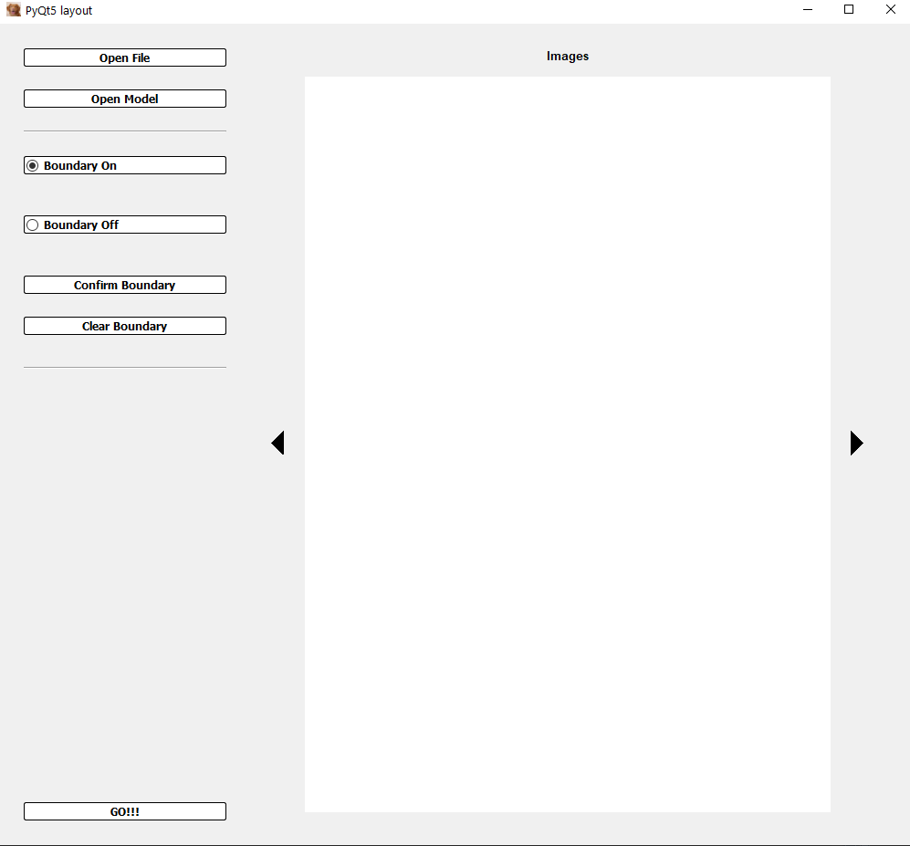

# Medical-Image-Segmentation-App
This app allows for the easy viewing of any .npy array (a single 2D image, multiple 2D images/a single 3D image, or multiple 3D images)
One can also upload a pretrained Convolutional Neural Network (CNN) in order to segment the uploaded images
Area cropping is also available

